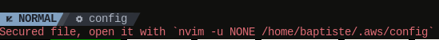
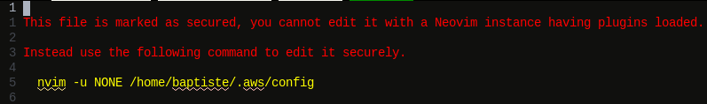
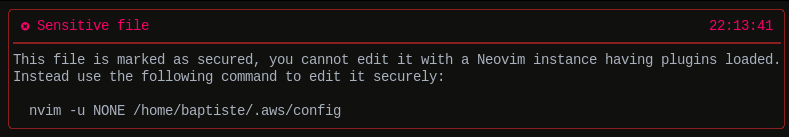

# :lock: readonly.nvim

[](https://github.com/rockerBOO/awesome-neovim)

A plugin to secure edition of files containing sensitive information (passwords, API keys, private keys, etc.).

You cannot guarantee all your Neovim plugins are 100% secured and do not leak sensitive information. 

So do not open a sensitive file under your standard `nvim` setup!


## :rocket: Goal

Suppose you configured [Github Copilot](https://github.com/features/copilot) in your Neovim install and you edit an SSH private key file. 

Are you 100% sure your SSH keys are not sent to Github?

Is it reasonable to have a blind trust with Github privacy? What if the privacy changes over time and is relaxed? What if a Github employee inserts a bug in the Copilot source code which leads to an accidental retention of Prompts? What about a data leak at Github? A hacker succeeding to steal data on the fly?

What about other plugins you installed and are testing? Are you sure they'll not send sensitive information remotely when you enter stuffs in your Neovim buffers?

The readonly.nvim plugin helps to not worry about secure data leaks by marking specific files as "sensitive".

When you try to open a file the reading process is by-passed and an error is displayed to indicate you to edit the file using a very basic editor (or editor command) instead.


## :zap: Requirements

`reaonly.nvim` only requires Neovim `>= 0.11.0` by default.

If you want to use the notification display mode you also need the [nvim-notify](https://github.com/rcarriga/nvim-notify) plugin.


## :arrow_up: Migrating from v1 to v2

To upgrade your configuration from version 1 to version 2 you just need to do 2 things.

 1. Version 1 of the plugin used a `secure_files` option which has been removed and replaced by a new `pattern` option.

    The `secured_files` option used standard Lua [Patterns](https://www.lua.org/pil/20.2.html) syntax. 
    
    The new `pattern` option uses Neovim autocmd patterns syntax. To migrate you need to convert your patterns to Neovim autocmd patterns, see the [Pattern matching](#large_blue_diamond-pattern-matching) section below for more details.

  2. If you wish to keep the same behavior enable the `notification` display mode (see [Notification](#notification)).


## :pencil: Usage

Suppose you would like to protect the following sensitive files.

- `~/.aws/config`
- `~/.aws/credentials`
- `~/.ssh/*`
- `~/.secrets.yaml`
- `~/.vault-crypt-files/*`

The following configures the plugin with the [lazy.nvim](https://github.com/folke/lazy.nvim) plugin manager (you can obviously use any plugin manager you like). 

```lua
return {
  "bgaillard/readonly.nvim",
  opts = {
    pattern = {
      vim.fn.expand("~") .. "/.aws/config",
      vim.fn.expand("~") .. "/.aws/credentials",
      vim.fn.expand("~") .. "/.ssh/*",
      vim.fn.expand("~") .. "/.secrets.yaml",
      vim.fn.expand("~") .. "/.vault-crypt-files/*",
    }
  },
  lazy = false
}
```

After configuration of the plugin opening the `~/.aws/config` file will perform the following actions.

  - Set the file with the ['readonly'](https://neovim.io/doc/user/options.html#'readonly') option equals to `true`
  - Set the file with the ['modifiable'](https://neovim.io/doc/user/options.html#'modifiable') option equals to `false`
  - Display a red message in the command line which indicates that the file is secure and must be opened with `nvim -u NONE ~/.aws/config`




## :large_blue_diamond: Pattern matching

The `pattern` option is used to configure the secured files, it can be a string or a table of strings.

The `pattern` option is passed to the [`nvim_create_autocmd`](https://neovim.io/doc/user/api.html#nvim_create_autocmd()) Neovim function internally. You'll find the complete documentation of patterns in the [`autocmd-pattern`](https://neovim.io/doc/user/autocmd.html#autocmd-pattern) section of the Neovim documentation.

:bulb: Be careful, as explained in the Neovim documentation `pattern` is not automatically expanded (unlike with [`:autocmd`](https://neovim.io/doc/user/autocmd.html#%3Aautocmd)), thus names like "$HOME" and "~" must be expanded explicitly (with [`vim.fn.expand("~")`](https://neovim.io/doc/user/builtin.html#expand()) for example).


## :desktop_computer: Display modes

The plugin supports three different display modes which are documented in the following sections.

By default only the [Command line](#pager-command-line) display mode is enabled but you can enable the other modes and have several modes enabled at the same time.

### :framed_picture: Buffer

The `buffer` mode is the most secured one because it completely prevents the files to be read.

As a result any plugin which could read a file and send it's content (or a part of it) remotely will not be able to do so.

When this mode is enabled opening a file displays the following message in the buffer.



To enable this mode just use the `display_modes.buffer` option and set the `enabled` property to `true`.

```lua
  return {
    "bgaillard/readonly.nvim",
    opts = {
      display_modes = {
        buffer = {
          enabled = true,
        }
      },
      pattern = {
        "/path/to/the/file",
      }
    },
    lazy = false
  }
```

### :pager: Command line

The `command_line` mode is the default mode of the plugin.

When this mode is enabled opening a file displays the following message in red in the Neovim command line.


To enable this mode use the `display_modes.command_line` option and set the `enabled` property to `true`.

```lua
  return {
    "bgaillard/readonly.nvim",
    opts = {
      display_modes = {
        command_line = {
          enabled = true,
        }
      },
      pattern = {
        "/path/to/the/file",
      }
    },
    lazy = false
  }
```

### :bell: Notification

The `notification` mode allows to use a specific notification plugin to
display the following message when a secured file is opened.



To enable this mode use the `display_modes.notification` option and set the `enabled` property to `true`.

```lua
  return {
    "bgaillard/readonly.nvim",
    dependencies = {
      "rcarriga/nvim-notify", -- Required for the notification display mode
    },
    opts = {
      display_modes = {
        notification = {
          enabled = true
        }
      },
      pattern = {
        "/path/to/the/file",
      }
    },
    lazy = false
  }
```

For now the plugin only supports the [nvim-notify](https://github.com/rcarriga/nvim-notify) notification plugin and uses it with those default parameters that you can override using the `opts` property.

```lua
  return {
    "bgaillard/readonly.nvim",
    dependencies = {
      "rcarriga/nvim-notify", -- Required for the notification display mode
    },
    opts = {
      display_modes = {
        notification = {

          --- Whether to enable notifications
          enabled = true

          --- Default options for "rcarriga/nvim-notify"
          ---
          --- You can override those options to customize the notification.
          ---
          --- see https://github.com/rcarriga/nvim-notify/blob/master/lua/notify/config/init.lua
          opts = {
            level = vim.log.levels.ERROR,
            timeout = 5000,
            max_width = nil,
            max_height = nil,
            stages = "fade_in_slide_out",
            render = "default",
            background_colour = "#000000",
            on_open = nil,
            on_close = nil,
            minimum_width = 50,
            fps = 30,
            top_down = true,
            merge_duplicates = true,
            time_formats = {
              notification_history = "%FT%T",
              notification = "%T",
            },
            icons = {
              ERROR = "",
              WARN = "",
              INFO = "",
              DEBUG = "",
              TRACE = "✎",
            },
          }
      },
      pattern = {
        "/path/to/the/file",
      }
    },
    lazy = false
  }
```
