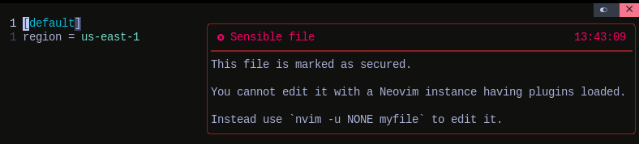

# :lock: readonly.nvim

[](https://github.com/rockerBOO/awesome-neovim)

A plugin to secure edition of files containing sensitive information (passwords, API keys, private keys, etc.).

You cannot guarantee all your Neovim plugins are 100% secured and do not leak sensitive information. 

So do not open a sensitive file under your standard `nvim` setup!

## :rocket: Goal

Suppose you configured [Github Copilot](https://github.com/features/copilot) in your Neovim install and you edit an SSH private key file. 

Are you 100% sure your SSH keys are not sent to Github?

Is it reasonable to have a blind trust with Github privacy? What if the privacy changes over time and is relaxed? What if a Github employee inserts a bug in the Copilot source code which leads to an accidental retention of Prompts? What about a data leak at Github? A hacker succeeding to steal data on the fly?

What about other plugins you installed and are testing? Are you sure they'll not send sensitive information remotely when you enter stuffs in your Neovim buffers?

The readonly.nvim plugin helps to not worry about secure data leaks by marking specific files as "sensitive". When you try to open a file the reading process is by-passed and an error is displayed to indicate you to edit the file using a very basic editor (or editor command) instead.

## :zap: Requirements

Just Neovim :smirk:

## :pencil: Usage

Suppose you would like to protect the following sensitive files.

- `~/.aws/config`
- `~/.aws/credentials`
- `~/.ssh/*`
- `~/.secrets.yaml`
- `~/.vault-crypt-files/*`

The following configures the plugin with the [lazy.nvim](https://github.com/folke/lazy.nvim) plugin manager (you can obviously use any plugin manager you like). 

It instructs the plugin to indicate that those files should never be writable using a standard Neovim call (i.e launched with the `nvim` command).

```lua
return {
  "bgaillard/readonly.nvim",
  opts = {
    pattern = {
      vim.fn.expand("~") .. "/.aws/config",
      vim.fn.expand("~") .. "/.aws/credentials",
      vim.fn.expand("~") .. "/.ssh/*",
      vim.fn.expand("~") .. "/.secrets.yaml",
      vim.fn.expand("~") .. "/.vault-crypt-files/*",
    }
  },
  lazy = false
}
```

After configuration of the plugin opening the `~/.aws/config` file will display the following floating window.



## :large_blue_diamond: Pattern matching

The only stuff to configure in the plugin is the `pattern` string or array which contains a list of patterns to match specific files and folders.

The `pattern` option is passed to the [`nvim_create_autocmd`](https://neovim.io/doc/user/api.html#nvim_create_autocmd()) Neovim function internally. You'll find the complete documentation of patterns in the [`autocmd-pattern`](https://neovim.io/doc/user/autocmd.html#autocmd-pattern) section of the Neovim documentation.

:bulb: Be careful, as explain in the Neovim documentation `pattern` is NOT automatically expanded (unlike with [`:autocmd`](https://neovim.io/doc/user/autocmd.html#%3Aautocmd)), thus names like "$HOME" and "~" must be expanded explicitly (with `vim.fn.expand("~")` for example).
